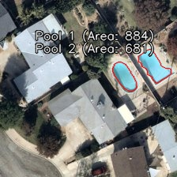

# Aerial Pool Detection Tool

This repository is the official repository for the pool detector tool. The project is a Command Line (CL) tool designed to detect swimming pools in aerial imagery using computer vision. It supports various pool shapes (rectangular, oval, and irregular) and handles complex environments like resorts or residential areas.

## Project Deliverables
- **CLI Script**: A Python script to process images.
- **coordinates.txt**: A structured text file containing the boundary points of detected pools.
- **output_image.jpg**: The result image with red outlines and labels.

## Technical Approach

Instead of a deep learning model which requires large datasets and high computational power, I implemented a robust image processing pipeline using **OpenCV**. This approach is highly efficient for real-time processing and easy to integrate.

### Logic Pipeline:
1. **Color Space Transformation**: The image is converted to **HSV** (Hue, Saturation, Value). This allows for better isolation of "Pool Blue" wavelengths regardless of lighting brightness.
2. **Spectral Filtering**: I applied specific saturation and value thresholds to distinguish vibrant pool water from neutral-colored objects like gray roofs, asphalt, or light green tiles.
3. **Morphological Refinement**: Using elliptical kernels, the script performs "Closing" and "Opening" operations to bridge gaps (like tree branches over a pool) and remove small noise (like umbrellas or chairs).
4. **Geometric Validation**: To ensure accuracy, shapes are filtered by **Solidity**. This ensures that only solid water bodies are detected, ignoring scattered shadows or blue artifacts.
5. **Contour Approximation**: The script uses a very low epsilon value in the approximation phase to ensure the red outline follows the organic curves of irregular pools perfectly.

## Setup Instructions

### 1. Requirements
- Python 3.8 or higher
- OpenCV (`opencv-python`)
- NumPy

### 2. Installation
Clone the repository and install the dependencies:

```bash
git clone https://github.com/YOUR_GITHUB_USERNAME/sanadtech-pool-detection.git
cd sanadtech-pool-detection
pip install -r requirements.txt
```
## Usage

Run the detection script from the project root:

    python src/pool_detector.py path/to/your/image.jpg

The script generates two output files in the project root:

- output_image.jpg  
  The image with detected pools outlined and labeled

- coordinates.txt  
  A detailed list of the points forming the shape of each detected pool

## Sample Results

The following examples demonstrate the script's ability to handle different environments, from residential backyards to complex resort layouts.

### Detection Output

Input Image  


Detection Result  



## Coordinate Format

The coordinates.txt file provides high-density points for each pool, sorted by area:

   --- POOL 1 ANALYSIS ---
Precision Points: 77 | Area: 884 px

Point 001: [188, 62]

Point 002: [187, 63]

Point 003: [186, 63]

Point 004: [185, 64]

Point 005: [184, 64]

Point 006: [181, 67]

Point 007: [180, 67]

Point 008: [178, 69]

Point 009: [177, 69]

Point 010: [175, 71]

...


## Repository Structure

    sanadtech-pool-detection/
    ├── src/
    │   └── pool_detector.py    # Main CLI detection logic
    ├── samples/                # Sample input images for testing
    ├── Outputs/                # outputs for samples
    ├── requirements.txt        # Required Python libraries
    ├── Input_Image             # Sample for test
    ├── coordinates.txt         # Generated coordinates (a sample)
    ├── result.jpg              # Annotated result 
    └── README.md               # Project documentation
